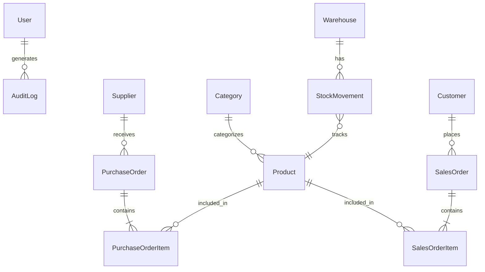

# Inventory Management API

A full-stack REST API for inventory management built with TypeScript, Express.js, and Prisma ORM. Manages products, warehouses, suppliers, purchase orders, sales orders, stock movements, and customers — with JWT authentication, role-based access control, audit logging, and OpenAPI documentation.

## Tech Stack

| Layer | Technology |
|-------|-----------|
| Runtime | Node.js |
| Language | TypeScript |
| Framework | Express.js |
| ORM | Prisma |
| Database | PostgreSQL |
| Auth | JWT (jsonwebtoken) |
| File Upload | Cloudinary |
| API Docs | Swagger (OpenAPI 3.0) |
| Security | Helmet · CORS · XSS-Clean |

## Features

- **JWT Authentication** — Register/login with secure token-based sessions via cookies
- **Role-Based Access Control** — Admin and User roles with permission checks on protected routes
- **Audit Logging** — Tracks CREATE, UPDATE, DELETE actions with user attribution
- **11 Data Models** — Full relational schema with foreign keys, enums, and auto-timestamps
- **Purchase Order Workflow** — Create orders, add line items, receive inventory, auto-update stock
- **Sales Order Workflow** — Customer orders with shipping status tracking (Pending → Shipped → Completed)
- **Stock Movement Tracking** — IN/OUT movements between warehouses with quantity management
- **OpenAPI Documentation** — Full Swagger spec with 30+ documented endpoints
- **Image Upload** — Profile picture and product image support via Cloudinary
- **Error Handling** — Custom error classes (BadRequest, NotFound, Unauthenticated, Unauthorized)

## 🏗️ Architecture & Database Schema



**Core Entities:** User, Category, Product, Supplier, Warehouse, PurchaseOrder, PurchaseOrderItem, StockMovement, Customer, SalesOrder, SalesOrderItem, AuditLog
## Quick Start

```bash
# Clone
git clone https://github.com/fardanahmed/inventory-management-api.git
cd inventory-management-api

# Install
npm install

# Configure
# Create .env with DATABASE_URL, JWT_SECRET, Cloudinary credentials

# Database setup
npx prisma migrate dev --name init
npx prisma generate

# Run
npm run dev
```

## API Endpoints

| Resource | Endpoints | Auth Required |
|----------|-----------|---------------|
| Auth | Register, Login, Logout | No |
| Users | CRUD, Update Password, Update Role | Admin |
| Categories | CRUD | Admin |
| Products | CRUD | Admin |
| Warehouses | CRUD | Admin |
| Suppliers | CRUD | Admin |
| Purchase Orders | Create, List, Update Status | Admin |
| Purchase Order Items | Add, Receive, List | Admin |
| Customers | CRUD | Yes |
| Stock Movements | IN/OUT, Reports | Admin |
| Sales Orders | CRUD, Status Tracking | Yes |
| Sales Order Items | Add, Ship, List | Yes |

## Project Structure

```
src/
├── app.ts               # Express app setup
├── configs/             # Cloudinary configuration
├── controllers/         # Route handlers (12 controllers)
├── errors/              # Custom error classes
├── interfaces/          # TypeScript interfaces
├── middleware/           # Auth, audit log, error handling
├── routes/              # Express route definitions
├── types/               # Environment type declarations
└── utils/               # JWT, permissions, mailer utilities
prisma/
├── schema.prisma        # Database schema (11 models)
└── migrations/          # Migration history
```

## Environment Variables

```env
PORT=5000
JWT_SECRET=your-jwt-secret
JWT_LIFETIME=1d
DATABASE_URL=postgresql://...
CLOUD_NAME=your-cloudinary-name
CLOUD_API_KEY=your-cloudinary-key
CLOUD_API_SECRET=your-cloudinary-secret
```

## License

MIT
